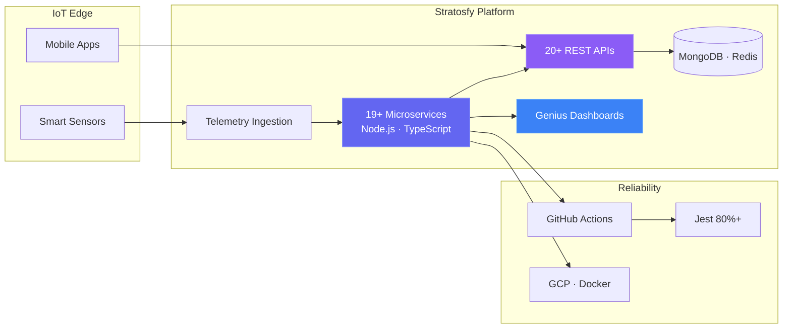

<!-- ═══════════════════════════════════════════════════════════════════════════
     Aitha Venkata Subbaiah · GitHub Profile
     Full Stack Engineer · IoT · Real-time · AI-augmented development
     ═══════════════════════════════════════════════════════════════════════════ -->

<div align="center">


<br />


</div>

<!-- ─── Identity Bento ─────────────────────────────────────────────────────── -->

<table>
<tr>
<td width="220" align="center" valign="top">


<br />

**Aitha Venkata Subbaiah**  
*Full Stack Engineer*

<br />

🟢 Available · Remote-first  
📍 Hyderabad, India

<br />

[](https://venkata-fullstack.vercel.app/)
[](https://venkata-fullstack.vercel.app/resume.pdf)

</td>
<td valign="top">

```yaml
whoami:   Aitha Venkata Subbaiah
role:     Full Stack Engineer
focus:    Scalable backends · Real-time systems · AI products

currently @ Stratosfy (Remote · Ottawa, CA)
  ├─ 19+ Node.js / TypeScript microservices
  ├─ 20+ REST APIs · telemetry ingestion pipelines
  ├─ Genius IoT dashboards · mobile app deployments
  └─ 80%+ Jest coverage · GitHub Actions CI/CD

previously:
  ├─ Backend Intern @ R K Microns — AI defect detection (+35% accuracy)
  └─ CS Expert @ Chegg — 500+ queries (DSA · DBMS · OS · SQL)

education:  B.Tech CSE (Business Systems) · RGMCET · CGPA 8.01
published:  Jarvis AI Assistant — Zenodo (2025)
open_to:    Full-time · Remote · Bangalore · Contract
```

</td>
</tr>
</table>

<!-- ─── Impact Metrics ─────────────────────────────────────────────────────── -->

<div align="center">

| `19+` | `20+` | `70%` | `80%` | `1.5yr` | `500+` |
|:---:|:---:|:---:|:---:|:---:|:---:|
| **Microservices** | **Production APIs** | **Downtime Cut** | **Test Coverage** | **Experience** | **CS Queries** |
| shipped to prod | telemetry & ops | via data modelling | Jest + CI/CD | IoT · SaaS · Real-time | Chegg expert |

</div>

<br />

<!-- ─── System Architecture (unique to your work) ──────────────────────────── -->

### ⚡ What I build at scale



<!-- ─── Social Proof ─────────────────────────────────────────────────────────── -->

> *"He demonstrated strong ownership on our IoT platform — delivering reliable, scalable full stack work across frontend, backend, and real-time systems while supporting production stability."*
>
> **Allaa Eddine Ikhlef** · Direct Manager · Stratosfy · [LinkedIn ↗](https://www.linkedin.com/in/aitha-venkata-subbaiah-setty/details/recommendations/)

<!-- ─── Engineering Depth ────────────────────────────────────────────────────── -->

<table>
<tr>
<td width="33%" valign="top">

**⚡ Latency Optimization**  
Sub-100ms API paths via MongoDB schema design & aggregation tuning.

</td>
<td width="33%" valign="top">

**📡 Realtime Reliability**  
Socket-driven flows with reconnect-safe patterns & scalable message persistence.

</td>
<td width="33%" valign="top">

**🛡️ Production Quality**  
80%+ coverage · CI/CD automation · robust API validation at every layer.

</td>
</tr>
</table>

<br />

<!-- ─── Featured Repos (live GitHub cards) ───────────────────────────────────── -->

### 🚀 Featured Work

<div align="center">

[](https://github.com/VenkataSubbaiah5022/Task-Management-System)
[](https://github.com/VenkataSubbaiah5022/Timesheet-Management-System)

[](https://github.com/VenkataSubbaiah5022/AI-Powered-Voice-Genie)
[](https://github.com/VenkataSubbaiah5022/Real-Time-Chat-Application)

</div>

<table>
<tr>
<td align="center"><a href="https://flowboard-system.vercel.app/"><b>Flowboard</b></a><br/><sub>Next.js · Prisma · Pusher · Turborepo</sub></td>
<td align="center"><a href="https://timesheet-management-system-sage.vercel.app/"><b>Timesheet</b></a><br/><sub>React · TypeScript · Role workflows</sub></td>
<td align="center"><a href="https://ai-voice-genie.vercel.app/"><b>Jarvis AI</b></a><br/><sub>Python · NLP · <a href="https://zenodo.org/records/15123556">Zenodo ↗</a></sub></td>
<td align="center"><a href="https://github.com/VenkataSubbaiah5022/Real-Time-Chat-Application"><b>Chat App</b></a><br/><sub>Socket.io · MERN · AWS EC2</sub></td>
</tr>
</table>

<p align="center">
  <a href="https://venkata-fullstack.vercel.app/projects"><b>→ Explore all projects on portfolio</b></a>
</p>

<!-- ─── Tech Stack (animated) ────────────────────────────────────────────────── -->

### 🛠️ Arsenal

<div align="center">


<br /><br />

**AI-augmented workflow:** Cursor · Claude Code · GitHub Copilot · OpenAI API · Claude API · Vercel AI SDK

</div>

<!-- ─── Experience (collapsible) ─────────────────────────────────────────────── -->

<details open>
<summary><b>💼 Experience Timeline</b></summary>
<br />

**Full Stack Developer** · [**Stratosfy**](https://login.genius.stratosfy.io/) · `Apr 2025 – Mar 2026` · Remote (Ottawa)

```
▸ 19+ microservices · Node.js · TypeScript · production IoT monitoring
▸ 20+ REST APIs for telemetry ingestion & operational dashboards
▸ Shipped to live apps → Play Store · App Store · Genius Platform
▸ 70% downtime reduction via data modelling & aggregation optimisations
▸ 80%+ Jest coverage · GitHub Actions CI/CD · Docker · GCP
```

**Backend Developer Intern** · R K Microns · `May – Oct 2024`

```
▸ Python pipelines for AI defect detection · +35% accuracy
▸ Reduced manual inspection by 2 hrs/day across 10+ operators
▸ Realtime visualization with Flutter frontend teams
```

**Computer Science Subject Expert** · Chegg · `Sep 2023 – Mar 2026`

```
▸ 500+ queries · DSA · DBMS · OS · SQL · Java · Python
```

</details>

<details>
<summary><b>🏅 Certifications & Credentials</b></summary>
<br />

| Credential | Issuer | Verify |
| :--- | :--- | :---: |
| Frontend Developer (React) | HackerRank | [↗](https://www.hackerrank.com/certificates/iframe/019f73606e1a) |
| API Fundamentals Student Expert | Postman | [↗](https://badges.parchment.com/public/assertions/XfiBS4qWSvmFUcQTyODrqA) |
| MongoDB Core Concepts & Architecture | MongoDB University | [↗](https://www.credly.com/badges/79fe32e9-a931-4767-a509-c84d77ff8e50/public_url) |
| AWS Cloud 101 · Serverless · Storage | AWS Educate | [↗](https://www.credly.com/badges/e9a32439-1330-4600-a2eb-5ef09f35171d/public_url) |
| Python for Data Science | IBM | [↗](https://www.credly.com/badges/10bb27bf-4852-4aba-853c-264558e30c19/public_url) |
| Flutter & Dart Certification | Google | — |
| Cloud Computing · IoT | NPTEL (IIT) | — |
| JavaScript — Unlocking the Power | Scaler Topics | [↗](https://moonshot.scaler.com/s/sl/YX5O1t3Aoo) |

<a href="https://venkata-fullstack.vercel.app/certifications"><b>→ View all 20+ certifications</b></a>

</details>

<!-- ─── GitHub Analytics ─────────────────────────────────────────────────────── -->

### 📊 GitHub Pulse

<div align="center">

<!-- 3D Contribution Profile -->
<picture>
  <source media="(prefers-color-scheme: dark)" srcset="https://github-profile-3d-contributions.vercel.app/profile/3d/VenkataSubbaiah5022?theme=nuclear&background=0d1117&size=normal&height=180&width=900&no_title=true&no_avatar=true&no_border=true&no_footer=true" />
  <source media="(prefers-color-scheme: light)" srcset="https://github-profile-3d-contributions.vercel.app/profile/3d/VenkataSubbaiah5022?theme=gray&background=ffffff&size=normal&height=180&width=900&no_title=true&no_avatar=true&no_border=true&no_footer=true" />
  
</picture>

<br /><br />


<br />


<br /><br />


<br /><br />

<!-- Contribution Snake (auto-generated via GitHub Action) -->
<picture>
  <source media="(prefers-color-scheme: dark)" srcset="https://raw.githubusercontent.com/VenkataSubbaiah5022/VenkataSubbaiah5022/output/github-contribution-grid-snake-dark.svg" />
  <source media="(prefers-color-scheme: light)" srcset="https://raw.githubusercontent.com/VenkataSubbaiah5022/VenkataSubbaiah5022/output/github-contribution-grid-snake.svg" />
  
</picture>

<br /><br />


</div>

<!-- ─── Connect ──────────────────────────────────────────────────────────────── -->

<div align="center">

### 🤝 Let's build something great

Looking for **product teams** and **backend-heavy roles** — full-time, remote, or contract.

<br />

[](https://www.linkedin.com/in/aitha-venkata-subbaiah-setty/)
[](mailto:venkatasubbaiah5022@gmail.com)
[](https://venkata-fullstack.vercel.app/)
[](https://zenodo.org/records/15123556)

<br /><br />


</div>
