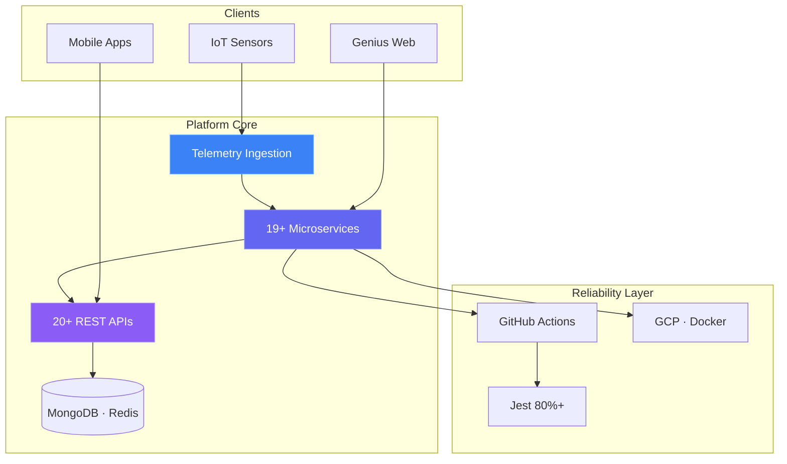

<!-- Aitha Venkata Subbaiah · github.com/VenkataSubbaiah5022 -->

<div align="center">


<br />

[](https://venkata-fullstack.vercel.app/)
[](https://www.linkedin.com/in/aitha-venkata-subbaiah-setty/)
[](mailto:venkatasubbaiah5022@gmail.com)
[](https://venkata-fullstack.vercel.app/resume.pdf)

<br />


</div>

<!-- Identity -->

<table>
<tr>
<td width="180" align="center" valign="top">


<br />

**Aitha Venkata Subbaiah**  
<sub>Full Stack Engineer · Hyderabad</sub>

<br />


</td>
<td valign="top">

```yaml
whoami:     Aitha Venkata Subbaiah
role:       Full Stack Engineer
craft:      Build → Ship → Iterate

currently:  Full Stack Developer @ Stratosfy (Remote · Ottawa)
stack:      Node.js · TypeScript · MongoDB · GCP · Docker · Jest
shipping:   19+ microservices · 20+ REST APIs · Genius IoT dashboards
impact:     70% downtime reduction · 80%+ test coverage · CI/CD

focus:
  - Scalable backends & microservice architecture
  - Real-time systems · WebSockets · telemetry pipelines
  - AI-augmented products · Claude API · OpenAI · Vercel AI SDK

education:  B.Tech CSE (Business Systems) · RGMCET · CGPA 8.01
published:  Jarvis AI Assistant → Zenodo (2025)
open_to:    Full-time · Remote · Bangalore · Contract
```

</td>
</tr>
</table>

<!-- Impact -->

<div align="center">

| **`19+`** | **`20+`** | **`70%`** | **`80%`** | **`1.5yr`** | **`500+`** |
| :---: | :---: | :---: | :---: | :---: | :---: |
| Microservices | Production APIs | Downtime cut | Test coverage | Experience | CS queries |
| Node · TypeScript | Telemetry & ops | Data modelling | Jest · CI/CD | IoT · SaaS | Chegg expert |

</div>

<!-- Architecture -->

### ⚡ Production systems I architect



<!-- Social proof -->

<table>
<tr>
<td width="50%" valign="top">

> *"He demonstrated **strong ownership** on our IoT platform — delivering reliable, scalable full stack work across frontend, backend, and real-time systems while supporting production stability."*
>
> **Allaa Eddine Ikhlef** · Direct Manager · Stratosfy

</td>
<td width="50%" valign="top">

> *"Supportive, quick to resolve issues, and consistent on quality. His full stack delivery made **QA collaboration smooth and effective**."*
>
> **Geetha Niharika** · Senior QA Analyst · Stratosfy

</td>
</tr>
</table>

<p align="center"><a href="https://www.linkedin.com/in/aitha-venkata-subbaiah-setty/details/recommendations/"><b>Read on LinkedIn →</b></a></p>

<!-- Engineering depth -->

| ⚡ Latency | 📡 Realtime | 🛡️ Quality |
| :--- | :--- | :--- |
| Sub-100ms API paths via MongoDB schema design & aggregation tuning | Socket flows with reconnect-safe patterns & scalable persistence | 80%+ coverage · CI/CD · API validation at every layer |

<br />

<!-- Projects -->

### 🚀 Featured work

<div align="center">

<a href="https://github.com/VenkataSubbaiah5022/Task-Management-System">
  
</a>
<a href="https://github.com/VenkataSubbaiah5022/Timesheet-Management-System">
  
</a>

<br />

<a href="https://github.com/VenkataSubbaiah5022/AI-Powered-Voice-Genie">
  
</a>
<a href="https://github.com/VenkataSubbaiah5022/Real-Time-Chat-Application">
  
</a>

</div>

| Project | Stack | Live |
| :--- | :--- | :---: |
| [**Flowboard**](https://github.com/VenkataSubbaiah5022/Task-Management-System) | Next.js · Prisma · Pusher | [Demo ↗](https://flowboard-system.vercel.app/) |
| [**Timesheet**](https://github.com/VenkataSubbaiah5022/Timesheet-Management-System) | React · TypeScript · Tailwind | [Demo ↗](https://timesheet-management-system-sage.vercel.app/) |
| [**Jarvis AI**](https://github.com/VenkataSubbaiah5022/AI-Powered-Voice-Genie) | Python · NLP · Speech | [Demo ↗](https://ai-voice-genie.vercel.app/) |
| [**Real-Time Chat**](https://github.com/VenkataSubbaiah5022/Real-Time-Chat-Application) | MERN · Socket.io · AWS | — |

<p align="center"><a href="https://venkata-fullstack.vercel.app/projects"><b>→ All projects on portfolio</b></a></p>

<!-- Tech stack -->

### 🛠️ Tech arsenal

<div align="center">


</div>

| Layer | Tools |
| :--- | :--- |
| **Frontend** | React · Next.js · TypeScript · Tailwind · Angular |
| **Mobile** | React Native · Expo · Flutter |
| **Backend** | Node.js · Express · Python · REST · WebSockets · Microservices |
| **Data** | MongoDB · PostgreSQL · MySQL · Redis · Prisma |
| **Cloud & DevOps** | Docker · GCP · AWS · GitHub Actions · Jest |
| **AI workflow** | Cursor · Claude Code · Copilot · OpenAI · Claude API |

<!-- Experience -->

<details open>
<summary><b>💼 Experience</b></summary>
<br />

**Full Stack Developer** · [**Stratosfy**](https://login.genius.stratosfy.io/) · `Apr 2025 – Mar 2026` · Remote (Ottawa)

- Built **19+ microservices** with Node.js & TypeScript for production IoT monitoring
- Shipped **20+ REST APIs** for telemetry ingestion & operational dashboards
- Deployed to [Play Store ↗](https://play.google.com/store/apps/details?id=io.stratosfy.tempgenie) · [App Store ↗](https://apps.apple.com/ca/app/stratosfy/id1573760988) · [Genius ↗](https://login.genius.stratosfy.io/)
- Reduced downtime **70%** via data modelling · 80%+ Jest · GitHub Actions CI/CD

**Backend Developer Intern** · R K Microns · `May – Oct 2024` — Python AI defect detection · **+35% accuracy**

**CS Subject Expert** · Chegg · `Sep 2023 – Mar 2026` — **500+** queries · DSA · DBMS · OS · SQL

</details>

<details>
<summary><b>🏅 Certifications</b> — 20+ credentials</summary>
<br />

<div align="center">

[](https://www.hackerrank.com/certificates/iframe/019f73606e1a)
[](https://badges.parchment.com/public/assertions/XfiBS4qWSvmFUcQTyODrqA)
[](https://www.credly.com/badges/79fe32e9-a931-4767-a509-c84d77ff8e50/public_url)
[](https://www.credly.com/badges/e9a32439-1330-4600-a2eb-5ef09f35171d/public_url)

</div>

<p align="center"><a href="https://venkata-fullstack.vercel.app/certifications"><b>→ Full certification gallery</b></a></p>

</details>

<!-- GitHub analytics -->

### 📊 GitHub activity

<div align="center">


<br /><br />


<br /><br />

<picture>
  <source media="(prefers-color-scheme: dark)" srcset="./assets/github-contribution-grid-snake-dark.svg">
  <source media="(prefers-color-scheme: light)" srcset="./assets/github-contribution-grid-snake.svg">
  
</picture>

<br /><br />


</div>

<!-- Connect -->

<div align="center">

### 🤝 Open to opportunities

Product teams · backend-heavy roles · full-time · remote · contract

<br />

[](https://www.linkedin.com/in/aitha-venkata-subbaiah-setty/)
[](mailto:venkatasubbaiah5022@gmail.com)
[](https://venkata-fullstack.vercel.app/)
[](https://zenodo.org/records/15123556)

<br /><br />


</div>
