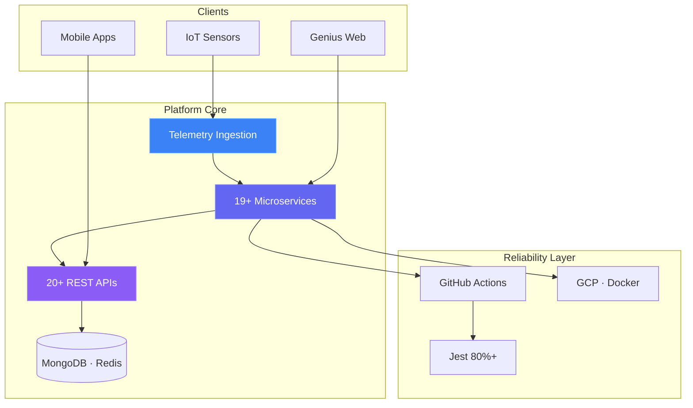

<!-- Aitha Venkata Subbaiah · github.com/VenkataSubbaiah5022 -->

<!-- Hero -->

 

 

<!-- ── Identity ─────────────────────────────────────────────────────────────── -->

<table>
<tr>
<td width="210" align="center" valign="top">

<!-- ── Impact ───────────────────────────────────────────────────────────────── -->

| **`19+`** | **`20+`** | **`70%`** | **`80%`** | **`1.5yr`** | **`500+`** |
| :----------------: | :---------------: | :---------------: | :---------------: | :-----------------: | :----------------: |
|   Microservices   |  Production APIs  |   Downtime cut   |   Test coverage   |     Experience     | CS queries solved |
| Node · TypeScript |  Telemetry & ops  |  Data modelling  |   Jest · CI/CD   |     IoT · SaaS     |    Chegg expert    |

<!-- ── Architecture ─────────────────────────────────────────────────────────── -->

### ⚡ Production systems I architect

<!-- ── Social proof ─────────────────────────────────────────────────────────── -->

<table>
<tr>
<td width="50%" valign="top">

<a href="https://www.linkedin.com/in/aitha-venkata-subbaiah-setty/details/recommendations/"><b>Read on LinkedIn →</b></a>

<!-- ── Engineering depth ────────────────────────────────────────────────────── -->

<table>
<tr>
<td align="center" width="33%">

 

<!-- ── Projects ───────────────────────────────────────────────────────────────── -->

### 🚀 Featured work

| Project                                                                                       | Stack                                    |                             Live                             |
| :-------------------------------------------------------------------------------------------- | :--------------------------------------- | :----------------------------------------------------------: |
| [**Flowboard**](https://github.com/VenkataSubbaiah5022/Task-Management-System)             | Next.js · Prisma · Pusher · Turborepo |         [Demo ↗](https://flowboard-system.vercel.app/)         |
| [**Timesheet System**](https://github.com/VenkataSubbaiah5022/Timesheet-Management-System) | React · TypeScript · Tailwind          | [Demo ↗](https://timesheet-management-system-sage.vercel.app/) |
| [**Jarvis AI**](https://github.com/VenkataSubbaiah5022/AI-Powered-Voice-Genie)             | Python · NLP · Speech · TTS           |          [Demo ↗](https://ai-voice-genie.vercel.app/)          |
| [**Real-Time Chat**](https://github.com/VenkataSubbaiah5022/Real-Time-Chat-Application)    | MERN · Socket.io · AWS EC2             |                              —                              |

<a href="https://venkata-fullstack.vercel.app/projects"><b>→ All projects on portfolio</b></a>

<!-- ── Tech stack ─────────────────────────────────────────────────────────────── -->

### 🛠️ Tech arsenal

`  `

| Layer                    | Tools                                                                            |
| :----------------------- | :------------------------------------------------------------------------------- |
| **Frontend**       | React · Next.js · TypeScript · Tailwind · Angular · Framer Motion           |
| **Mobile**         | React Native · Expo · Flutter                                                  |
| **Backend**        | Node.js · Express · Python · REST · WebSockets · Socket.io · Microservices |
| **Data**           | MongoDB · PostgreSQL · MySQL · Redis · Prisma                                |
| **Cloud & DevOps** | Docker · GCP · AWS · GitHub Actions · NGINX · Jest · Pytest                |
| **AI workflow**    | Cursor · Claude Code · Copilot · OpenAI API · Claude API · Vercel AI SDK    |

<!-- ── Experience ─────────────────────────────────────────────────────────────── -->

<b>💼 Experience</b>

 

**Full Stack Developer** · [**Stratosfy**](https://login.genius.stratosfy.io/) · `Apr 2025 – Mar 2026` · Remote (Ottawa)

|                                                                                          |                                                                                                                                                         |
| :--------------------------------------------------------------------------------------- | :------------------------------------------------------------------------------------------------------------------------------------------------------ |
| Built**19+ microservices** with Node.js & TypeScript for production IoT monitoring | [Play Store ↗](https://play.google.com/store/apps/details?id=io.stratosfy.tempgenie) · [App Store ↗](https://apps.apple.com/ca/app/stratosfy/id1573760988) |
| Shipped**20+ REST APIs** for telemetry ingestion & operational dashboards          | [Genius Platform ↗](https://login.genius.stratosfy.io/)                                                                                                   |
| Reduced downtime**70%** via data modelling & aggregation optimisations             | 80%+ Jest · GitHub Actions CI/CD                                                                                                                       |

**Backend Developer Intern** · R K Microns · `May – Oct 2024` — Python AI defect detection pipelines · **+35% accuracy** · saved 2 hrs/day across 10+ operators

**CS Subject Expert** · Chegg · `Sep 2023 – Mar 2026` — **500+** queries · DSA · DBMS · OS · SQL · Java · Python

<b>🏅 Certifications</b> — 20+ credentials

 

| Credential                               | Issuer                |                                                                                        |
| :--------------------------------------- | :-------------------- | :-------------------------------------------------------------------------------------: |
| Frontend Developer (React)               | HackerRank            |          [Verify ↗](https://www.hackerrank.com/certificates/iframe/019f73606e1a)          |
| API Fundamentals Student Expert          | Postman               |     [Verify ↗](https://badges.parchment.com/public/assertions/XfiBS4qWSvmFUcQTyODrqA)     |
| MongoDB Core Concepts                    | MongoDB University    | [Verify ↗](https://www.credly.com/badges/79fe32e9-a931-4767-a509-c84d77ff8e50/public_url) |
| AWS Cloud · Serverless · Storage       | AWS Educate           | [Verify ↗](https://www.credly.com/badges/e9a32439-1330-4600-a2eb-5ef09f35171d/public_url) |
| Python for Data Science                  | IBM                   | [Verify ↗](https://www.credly.com/badges/10bb27bf-4852-4aba-853c-264558e30c19/public_url) |
| JavaScript — Unlocking the Power        | Scaler Topics         |                  [Verify ↗](https://moonshot.scaler.com/s/sl/YX5O1t3Aoo)                  |
| Flutter & Dart · Cloud Computing · IoT | Google · NPTEL (IIT) |                                           —                                           |

<a href="https://venkata-fullstack.vercel.app/certifications"><b>→ Full certification gallery</b></a>

<!-- ── GitHub analytics ───────────────────────────────────────────────────────── -->

### 📊 GitHub activity

`  `

`  `

<!-- Snake: generated by .github/workflows/snake.yml → assets/ -->

<picture>
  <source media="(prefers-color-scheme: dark)" srcset="./assets/github-contribution-grid-snake-dark.svg">
  <source media="(prefers-color-scheme: light)" srcset="./assets/github-contribution-grid-snake.svg">
  
</picture>

`  `

<!-- ── Connect ────────────────────────────────────────────────────────────────── -->

### 🤝 Open to opportunities

Product teams · backend-heavy roles · full-time · remote · contract

 

`  `

